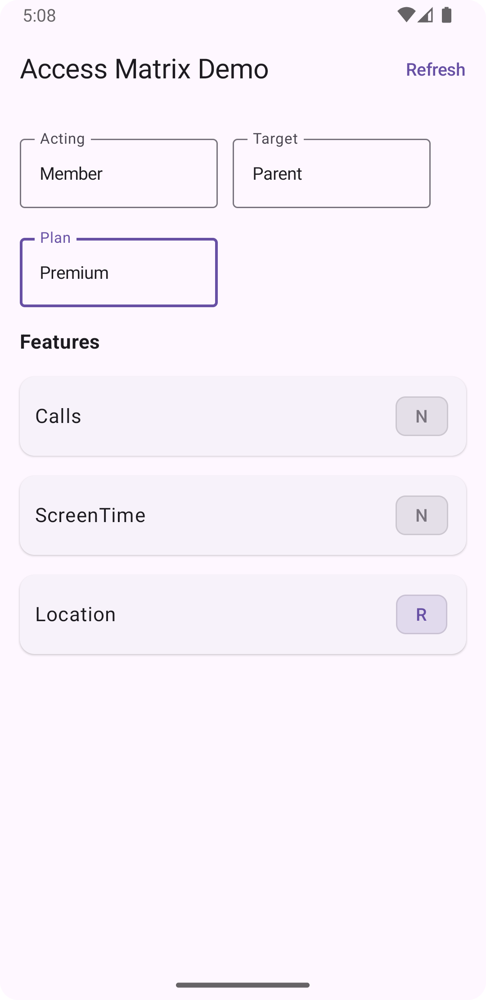

# 📱 Role-Based Feature Access App

A demonstration Android application that dynamically controls **feature visibility** (Calls, ScreenTime, Location) based on **user role**, **plan type**, and **access matrix configuration**.

This project was built as part of a technical assignment demonstrating **scalable configuration-driven access control**, using **Jetpack Compose**, **Hilt**, **Retrofit**, and **DataStore**.



---

## 🌍 Overview

The app loads a remote **YAML configuration file** defining the relationships between:

- **Plans** → Free, Basic, Premium
- **Features** → Calls, ScreenTime, Location
- **Roles** → Parent, Child, Member, Self

and a detailed **access matrix** specifying which acting user role can access which feature for a given target role under a specific plan.

The configuration is loaded at **app launch**, cached locally in **DataStore**, and visualized in a **Compose-based UI** that allows users to simulate role and plan combinations.

---

## ✨ Features

| Category | Description |
|-----------|--------------|
| 🧱 **Dynamic Configuration** | Loads feature access rules from a YAML file hosted on GitHub Pages. |
| 🔄 **Offline Persistence** | Configuration cached in Jetpack DataStore for offline usage. |
| ⚙️ **Hilt DI** | Fully dependency-injected architecture for modularity and testing. |
| 🧭 **UseCase Layer** | Encapsulates logic for evaluating access rules (`GetFeaturesUseCase`). |
| 🧠 **Composable UI** | Reactive, state-driven UI built with Jetpack Compose. |
| 🧪 **Unit Tests** | Comprehensive coroutine-based tests with MockK and Turbine. |

---

## 🧱 Architecture

This project follows a **Clean Architecture** with a **MVI (Model-View-Intent)** presentation layer.

```
┌──────────────────────────────┐
│          UI Layer            │
│  (Jetpack Compose + MVI VM)  │
└──────────────┬───────────────┘
┌──────────────┴────────────────┐
│        Domain Layer           │
│  GetFeaturesUseCase.kt        │
│  (Business logic: maps config │
│   → visible features)         │
└──────────────┬────────────────┘
┌──────────────┴───────────────┐
│      Data Layer (DI+Repo)    │
│ PlansConfigRepository.kt     │
│ ConfigApi.kt (Retrofit YAML) │
│ DataStore persistence        │
└──────────────────────────────┘
```

---

## ⚙️ Config Loading

### YAML Structure Example
```yaml
version: 1
generated_at: 2025-10-04

features:
  - Calls
  - ScreenTime
  - Location

plans:
  Free:
    features: [Calls]
  Basic:
    features: [Calls, ScreenTime]
  Premium:
    features: [Calls, ScreenTime, Location]

roles:
  - Parent
  - Child
  - Member
  - Self

access:
  Parent:
    Child:
      Free: { Calls: R, ScreenTime: N, Location: N }
      Premium: { Calls: R, ScreenTime: R, Location: R }
```

---

## 🌐 Remote Source

The configuration YAML file defining roles, plans, and feature access rules is hosted publicly on **GitHub Pages**.

### Remote YAML URL

https://o-tomin.github.io/otomin-role-based-access-config/plans_matrix.yml

---

## Project Structure

```
com.otomin.app
│
├── MyApplication.kt             # Hilt entry point
├── Constants.kt                 # Global TAG and constants
│
├── api/
│   └── ConfigApi.kt             # Retrofit interface to fetch YAML
│
├── di/
│   ├── NetworkModule.kt         # Retrofit + YAMLMapper setup
│   ├── DispatcherModule.kt      # Provides CoroutineDispatchers
│   ├── DataStoreModule.kt       # DataStore setup & serializer
│   └── ConfigModule.kt          # Provides UseCaseCoroutineScope
│
├── model/
│   ├── PlansConfig.kt           # Root config model
│   ├── PlanId.kt, Role.kt       # Enums
│   ├── Plan.kt, Feature.kt      # Submodels
│   └── AccessFlag.kt            # Enum for R/N flags
│
├── reopsitory/
│   └── PlansConfigRepository.kt # DataStore + network integration
│
├── ui/
│   ├── MainActivity.kt          # App entry point (Compose)
│   ├── MviBaseViewModel.kt      # MVI base
│   ├── UseCaseCoroutineScope.kt # Custom coroutine scope
│   ├── BaseUseCase.kt           # Reactive use case abstraction
│   ├── config/                  # Role-based configuration UI
│   │   ├── ConfigRoute.kt
│   │   ├── ConfigContentScreen.kt
│   │   ├── FeatureRowItem.kt
│   │   └── EnumDropdown.kt
│   └── util/
│       └── collectAsStateWithLifecycle.kt
│
└── tests/
├── BaseUseCaseTest.kt
├── PlansConfigRepositoryTest.kt
└── GetFeaturesUseCaseTest.kt

```

---

## 🛠️ Tech Stack

This project leverages modern Android technologies with a clean and testable architecture.

| Layer / Module              | Technology / Library                                 |
|-----------------------------|------------------------------------------------------|
| 🎨 **UI**                   | Jetpack Compose (Material 3)                         |
| 🧭 **Architecture**         | Clean Architecture + MVI (Model-View-Intent)         |
| ⚙️ **Dependency Injection** | Hilt (Dagger 2)                                      |
| 🌐 **Networking**           | Retrofit + Jackson YAML Mapper                       |
| 💾 **Local Persistence**    | Jetpack DataStore (kotlinx.serialization)            |
| 🧵 **Concurrency**          | Kotlin Coroutines + Dispatchers (IO, Main, Default)  |
| 🧩 **Configuration**        | External YAML loaded via GitHub Pages                |
| 🧠 **State Management**     | MVI-based ViewModel + StateFlow                      |
| 🧪 **Testing Frameworks**   | JUnit, MockK, Turbine, kotlinx-coroutines-test       |
| 📄 **Documentation**        | KDoc + Dokka HTML output                             |
| 🧰 **Build System**         | Gradle Kotlin DSL                                    |
